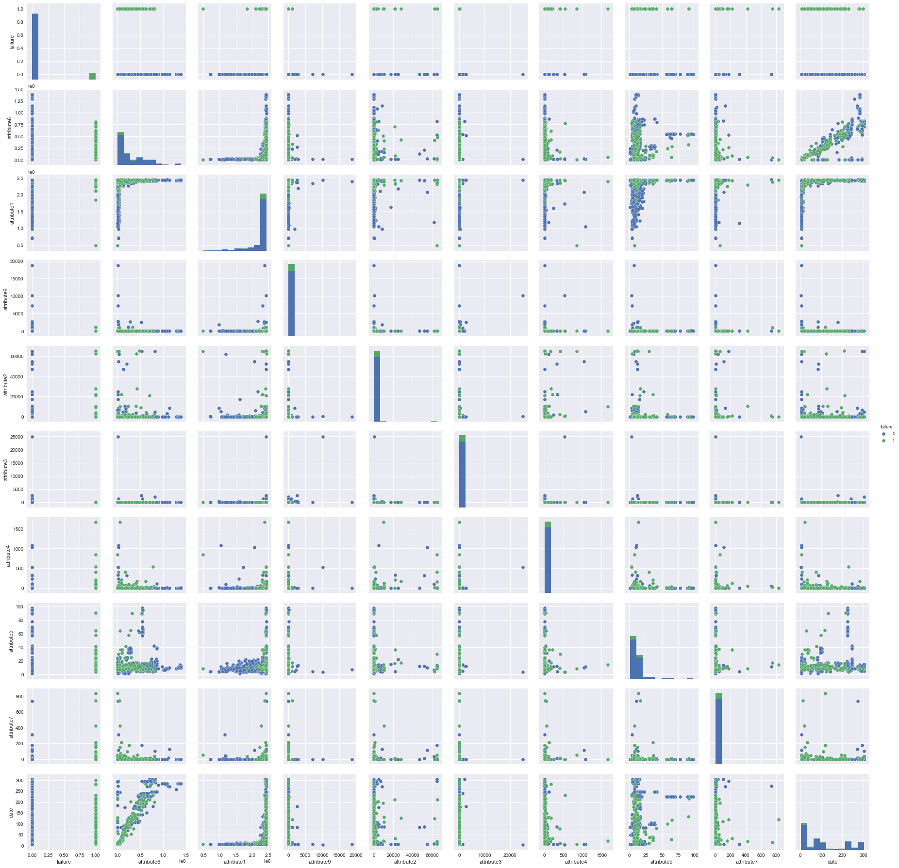
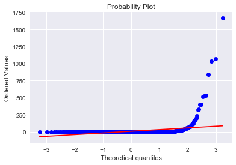
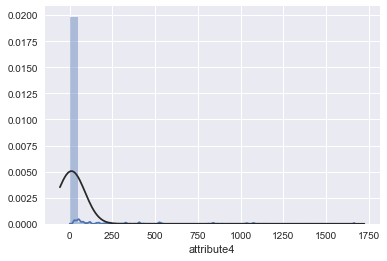
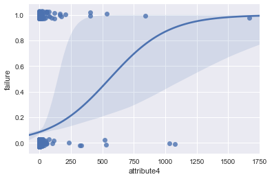
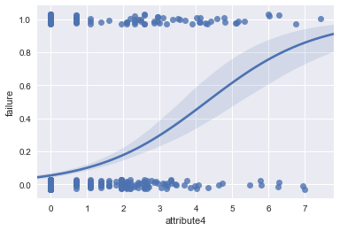
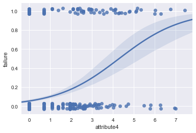
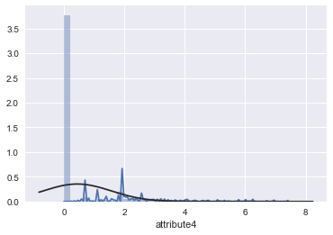
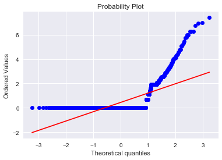
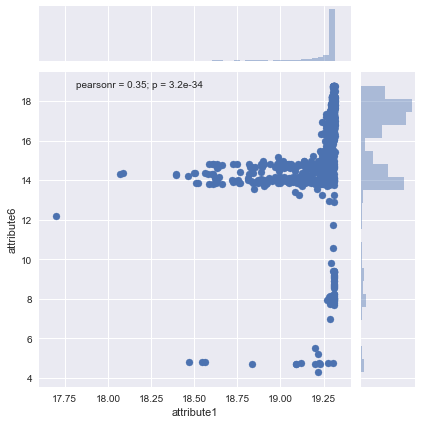
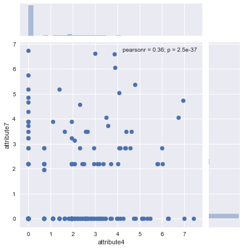

```python
#import libraries
import pandas as pd
import numpy as np
from scipy.stats.mstats import mode
from sklearn.preprocessing import LabelEncoder
from sklearn.model_selection import cross_val_score

from sklearn import linear_model
from sklearn.cross_validation import train_test_split, KFold
from sklearn.metrics import confusion_matrix, accuracy_score
import matplotlib.pyplot as plt
import seaborn as sns; sns.set()
from IPython.display import Image, display

%matplotlib inline
```

# Introduction

This is a Project-based Learning (PBL) from the DevMasters - Mastering Applied Data Science program.  We were given a dataset that has 12 columns and no description of each, except the dates, device ID and a target variable, failure, which is binary.  Per our instructor, it is a common practice for employers to use such datasets to test prospective candidates.  The candidate is to build a predictive model within a short time and demonstrate his/her ability of solving the problem. 

# Business Objective

The business objective is to predict failure of the device based on a year's worth of data.

# The dataset

This dataset is relatively clean. There is no need for data cleaning. Nor is feature engineering required. Each record in the dataset is a trip to the device when it requires maintenance. There are no missing values.  What is unique about the dataset is that the failure (the minority) class is heavily under represented to that of the majority class.

Below I go through some exploratory data analysis, and get to modeling stage rather quickly to discuss the issues of imbalanced machine learning, using both oversampling and undersampling approaches. I use the Index of Balanced Accuracy (IBA) and geometric mean of specificity and sensitivity to compare the performance of a RandomfForest classifier between the two approaches. A Linear Support Vector classifier was also run.

# Exploratory Data Analysis

An exploratory data analysis reveals that 
1. All attributes are of integer data type;
2. Attribute7 and attribute8 are exactly the same. Attribute8 is dropped;
3. Of the 124,494 records for the year, there were only 106 failures. The date is when a device is visited. Either groupby function or pivot table function can be used to aggregate to the device level;
4. Some attributes have limited number of distictive values, indicating that they are likely to be categorical variable, such as attribute4, 7 and 9;
5. Attribute1 and 6 are likely to be continuous variables;
6. Attribute3 and 9 are dropped based on the correlation with the failure variable;
7. numpy log(1 + attribute) is used to transform some attributes;

After groupby function is applied, there were 1,062 majority cases and 106 minority cases (roughly 10%). And it is the starting point of this demonstration to show that in imbalanced machine learning oversampling and undersampling approaches are frequently used to deal with imbalanced datasets. And it turns out that undersampling approach can do better than oversampling approach, even when the dataset is relatively small.  


```python
#read in the dataset
df = pd.read_csv('failures.csv')
```


```python
#check if there are missing values
df.isnull().sum()  
```


    date          0
    device        0
    failure       0
    attribute1    0
    attribute2    0
    attribute3    0
    attribute4    0
    attribute5    0
    attribute6    0
    attribute7    0
    attribute8    0
    attribute9    0
    dtype: int64


## Groupby (will lose an object column) and merge # of dates file


```python
#dimension of the dataframe before aggregation
df.shape
```


    (124494, 12)


```python
df['failure'].value_counts(dropna=False)
```


    0    124388
    1       106
    Name: failure, dtype: int64


```python
#aggregate by device, the number of dates a certain device is visited for maintenance 
date_cnt = df.groupby('device')['date'].count()
```


```python
#groupby device numerical variables - either use max or sum
df = df.groupby('device').agg({'failure' : 'sum', 'attribute6' : 'sum',
                               'attribute1':'max', 'attribute9': 'max', 
                               'attribute2':'max', 'attribute3': 'max', 'attribute4' : 'max',
                               'attribute5':'max', 'attribute7': 'max'})
```


```python
#a total of 1168 unique devices
df.shape
```


    (1168, 9)


```python
#merge the dataframe with aggregated the number of time a device is visited
result = pd.concat([df, date_cnt], axis=1, ignore_index=False)
```


```python
result.shape
```


    (1168, 10)


```python
#review last 30 observations of the analytic dataset
result.tail(30)
```


<div>
<style scoped>
    .dataframe tbody tr th:only-of-type {
        vertical-align: middle;
    }

    .dataframe tbody tr th {
        vertical-align: top;
    }

    .dataframe thead th {
        text-align: right;
    }
</style>
<table border="1" class="dataframe">
  <thead>
    <tr style="text-align: right;">
      <th></th>
      <th>failure</th>
      <th>attribute6</th>
      <th>attribute1</th>
      <th>attribute9</th>
      <th>attribute2</th>
      <th>attribute3</th>
      <th>attribute4</th>
      <th>attribute5</th>
      <th>attribute7</th>
      <th>date</th>
    </tr>
    <tr>
      <th>device</th>
      <th></th>
      <th></th>
      <th></th>
      <th></th>
      <th></th>
      <th></th>
      <th></th>
      <th></th>
      <th></th>
      <th></th>
    </tr>
  </thead>
  <tbody>
    <tr>
      <th>Z1F1A0LM</th>
      <td>0</td>
      <td>80321583</td>
      <td>243675552</td>
      <td>0</td>
      <td>0</td>
      <td>0</td>
      <td>0</td>
      <td>7</td>
      <td>0</td>
      <td>295</td>
    </tr>
    <tr>
      <th>Z1F1A0RP</th>
      <td>0</td>
      <td>62743931</td>
      <td>243835032</td>
      <td>0</td>
      <td>0</td>
      <td>0</td>
      <td>0</td>
      <td>7</td>
      <td>0</td>
      <td>295</td>
    </tr>
    <tr>
      <th>Z1F1A1HH</th>
      <td>0</td>
      <td>72347021</td>
      <td>243813992</td>
      <td>0</td>
      <td>0</td>
      <td>0</td>
      <td>0</td>
      <td>7</td>
      <td>0</td>
      <td>295</td>
    </tr>
    <tr>
      <th>Z1F1A7MG</th>
      <td>0</td>
      <td>569544</td>
      <td>199176360</td>
      <td>0</td>
      <td>168</td>
      <td>0</td>
      <td>11</td>
      <td>7</td>
      <td>0</td>
      <td>6</td>
    </tr>
    <tr>
      <th>Z1F1A83K</th>
      <td>0</td>
      <td>3076</td>
      <td>240870336</td>
      <td>0</td>
      <td>0</td>
      <td>0</td>
      <td>0</td>
      <td>12</td>
      <td>0</td>
      <td>112</td>
    </tr>
    <tr>
      <th>Z1F1AD0M</th>
      <td>0</td>
      <td>19485542</td>
      <td>241675272</td>
      <td>0</td>
      <td>0</td>
      <td>0</td>
      <td>1</td>
      <td>21</td>
      <td>0</td>
      <td>82</td>
    </tr>
    <tr>
      <th>Z1F1AF54</th>
      <td>0</td>
      <td>114</td>
      <td>241932032</td>
      <td>0</td>
      <td>0</td>
      <td>0</td>
      <td>0</td>
      <td>7</td>
      <td>0</td>
      <td>6</td>
    </tr>
    <tr>
      <th>Z1F1AFF2</th>
      <td>0</td>
      <td>3088</td>
      <td>243992616</td>
      <td>0</td>
      <td>112</td>
      <td>0</td>
      <td>0</td>
      <td>12</td>
      <td>0</td>
      <td>84</td>
    </tr>
    <tr>
      <th>Z1F1AFT5</th>
      <td>0</td>
      <td>120</td>
      <td>115439712</td>
      <td>0</td>
      <td>0</td>
      <td>0</td>
      <td>0</td>
      <td>7</td>
      <td>0</td>
      <td>6</td>
    </tr>
    <tr>
      <th>Z1F1AG5N</th>
      <td>1</td>
      <td>186</td>
      <td>222479304</td>
      <td>0</td>
      <td>32</td>
      <td>0</td>
      <td>10</td>
      <td>7</td>
      <td>0</td>
      <td>9</td>
    </tr>
    <tr>
      <th>Z1F1AGLA</th>
      <td>0</td>
      <td>1203873</td>
      <td>134404400</td>
      <td>0</td>
      <td>0</td>
      <td>0</td>
      <td>0</td>
      <td>8</td>
      <td>0</td>
      <td>5</td>
    </tr>
    <tr>
      <th>Z1F1AGN5</th>
      <td>0</td>
      <td>1368263</td>
      <td>234101200</td>
      <td>0</td>
      <td>0</td>
      <td>0</td>
      <td>0</td>
      <td>8</td>
      <td>0</td>
      <td>5</td>
    </tr>
    <tr>
      <th>Z1F1AGW1</th>
      <td>0</td>
      <td>1412352</td>
      <td>238702720</td>
      <td>18701</td>
      <td>0</td>
      <td>0</td>
      <td>0</td>
      <td>7</td>
      <td>0</td>
      <td>5</td>
    </tr>
    <tr>
      <th>Z1F1B6H4</th>
      <td>0</td>
      <td>108</td>
      <td>224579736</td>
      <td>1</td>
      <td>0</td>
      <td>0</td>
      <td>0</td>
      <td>7</td>
      <td>0</td>
      <td>6</td>
    </tr>
    <tr>
      <th>Z1F1B6NP</th>
      <td>0</td>
      <td>9481</td>
      <td>242994104</td>
      <td>1</td>
      <td>0</td>
      <td>0</td>
      <td>0</td>
      <td>12</td>
      <td>0</td>
      <td>292</td>
    </tr>
    <tr>
      <th>Z1F1B799</th>
      <td>0</td>
      <td>11879</td>
      <td>243098976</td>
      <td>0</td>
      <td>0</td>
      <td>0</td>
      <td>0</td>
      <td>16</td>
      <td>0</td>
      <td>245</td>
    </tr>
    <tr>
      <th>Z1F1CZ35</th>
      <td>0</td>
      <td>25727658</td>
      <td>243936472</td>
      <td>3</td>
      <td>0</td>
      <td>0</td>
      <td>0</td>
      <td>9</td>
      <td>0</td>
      <td>103</td>
    </tr>
    <tr>
      <th>Z1F1FCH5</th>
      <td>1</td>
      <td>4312955</td>
      <td>241866296</td>
      <td>0</td>
      <td>0</td>
      <td>0</td>
      <td>6</td>
      <td>7</td>
      <td>24</td>
      <td>19</td>
    </tr>
    <tr>
      <th>Z1F1FZ9J</th>
      <td>0</td>
      <td>10779606</td>
      <td>242058976</td>
      <td>0</td>
      <td>0</td>
      <td>0</td>
      <td>0</td>
      <td>5</td>
      <td>0</td>
      <td>48</td>
    </tr>
    <tr>
      <th>Z1F1HEQR</th>
      <td>0</td>
      <td>992451</td>
      <td>120474016</td>
      <td>0</td>
      <td>0</td>
      <td>0</td>
      <td>0</td>
      <td>4</td>
      <td>0</td>
      <td>6</td>
    </tr>
    <tr>
      <th>Z1F1HSWK</th>
      <td>0</td>
      <td>2161548</td>
      <td>208877824</td>
      <td>6</td>
      <td>0</td>
      <td>0</td>
      <td>0</td>
      <td>5</td>
      <td>0</td>
      <td>6</td>
    </tr>
    <tr>
      <th>Z1F1Q9BD</th>
      <td>0</td>
      <td>19891562</td>
      <td>243823328</td>
      <td>0</td>
      <td>0</td>
      <td>0</td>
      <td>0</td>
      <td>7</td>
      <td>0</td>
      <td>82</td>
    </tr>
    <tr>
      <th>Z1F1R76A</th>
      <td>0</td>
      <td>84906596</td>
      <td>243842072</td>
      <td>12</td>
      <td>0</td>
      <td>0</td>
      <td>0</td>
      <td>8</td>
      <td>0</td>
      <td>245</td>
    </tr>
    <tr>
      <th>Z1F1RE71</th>
      <td>0</td>
      <td>1107448</td>
      <td>241454264</td>
      <td>0</td>
      <td>0</td>
      <td>1</td>
      <td>0</td>
      <td>3</td>
      <td>0</td>
      <td>6</td>
    </tr>
    <tr>
      <th>Z1F1RJFA</th>
      <td>1</td>
      <td>41342401</td>
      <td>243890056</td>
      <td>0</td>
      <td>62296</td>
      <td>1</td>
      <td>9</td>
      <td>4</td>
      <td>0</td>
      <td>124</td>
    </tr>
    <tr>
      <th>Z1F1VMZB</th>
      <td>0</td>
      <td>65039417</td>
      <td>242361392</td>
      <td>0</td>
      <td>0</td>
      <td>0</td>
      <td>0</td>
      <td>5</td>
      <td>0</td>
      <td>292</td>
    </tr>
    <tr>
      <th>Z1F1VQFY</th>
      <td>1</td>
      <td>31179620</td>
      <td>243071840</td>
      <td>0</td>
      <td>0</td>
      <td>0</td>
      <td>0</td>
      <td>7</td>
      <td>0</td>
      <td>125</td>
    </tr>
    <tr>
      <th>Z1F26YZB</th>
      <td>0</td>
      <td>24265015</td>
      <td>241938368</td>
      <td>0</td>
      <td>0</td>
      <td>1</td>
      <td>0</td>
      <td>1</td>
      <td>0</td>
      <td>84</td>
    </tr>
    <tr>
      <th>Z1F282ZV</th>
      <td>0</td>
      <td>15868420</td>
      <td>243169296</td>
      <td>0</td>
      <td>0</td>
      <td>1</td>
      <td>0</td>
      <td>1</td>
      <td>0</td>
      <td>84</td>
    </tr>
    <tr>
      <th>Z1F2PBHX</th>
      <td>0</td>
      <td>13186666</td>
      <td>243935864</td>
      <td>0</td>
      <td>0</td>
      <td>0</td>
      <td>0</td>
      <td>5</td>
      <td>0</td>
      <td>83</td>
    </tr>
  </tbody>
</table>
</div>


```python
#minority class has 106 observations, whereas the majority has 1,062 observations
result['failure'].value_counts(dropna=False)
```


    0    1062
    1     106
    Name: failure, dtype: int64


```python
#Examine the correlation among the variables
result.corr()
```


<div>
<style scoped>
    .dataframe tbody tr th:only-of-type {
        vertical-align: middle;
    }

    .dataframe tbody tr th {
        vertical-align: top;
    }

    .dataframe thead th {
        text-align: right;
    }
</style>
<table border="1" class="dataframe">
  <thead>
    <tr style="text-align: right;">
      <th></th>
      <th>failure</th>
      <th>attribute6</th>
      <th>attribute1</th>
      <th>attribute9</th>
      <th>attribute2</th>
      <th>attribute3</th>
      <th>attribute4</th>
      <th>attribute5</th>
      <th>attribute7</th>
      <th>date</th>
    </tr>
  </thead>
  <tbody>
    <tr>
      <th>failure</th>
      <td>1.000000</td>
      <td>-0.027355</td>
      <td>0.099725</td>
      <td>-0.012201</td>
      <td>0.178851</td>
      <td>-0.011711</td>
      <td>0.181233</td>
      <td>0.077348</td>
      <td>0.204515</td>
      <td>-0.017000</td>
    </tr>
    <tr>
      <th>attribute6</th>
      <td>-0.027355</td>
      <td>1.000000</td>
      <td>0.411288</td>
      <td>-0.046693</td>
      <td>-0.022909</td>
      <td>-0.018768</td>
      <td>-0.057795</td>
      <td>0.150072</td>
      <td>-0.050576</td>
      <td>0.879975</td>
    </tr>
    <tr>
      <th>attribute1</th>
      <td>0.099725</td>
      <td>0.411288</td>
      <td>1.000000</td>
      <td>0.008648</td>
      <td>-0.071950</td>
      <td>0.016221</td>
      <td>-0.113202</td>
      <td>0.162886</td>
      <td>-0.007493</td>
      <td>0.474314</td>
    </tr>
    <tr>
      <th>attribute9</th>
      <td>-0.012201</td>
      <td>-0.046693</td>
      <td>0.008648</td>
      <td>1.000000</td>
      <td>-0.006273</td>
      <td>0.447703</td>
      <td>0.078266</td>
      <td>-0.028133</td>
      <td>0.015573</td>
      <td>-0.056289</td>
    </tr>
    <tr>
      <th>attribute2</th>
      <td>0.178851</td>
      <td>-0.022909</td>
      <td>-0.071950</td>
      <td>-0.006273</td>
      <td>1.000000</td>
      <td>-0.003510</td>
      <td>0.347504</td>
      <td>-0.006053</td>
      <td>0.081082</td>
      <td>-0.017311</td>
    </tr>
    <tr>
      <th>attribute3</th>
      <td>-0.011711</td>
      <td>-0.018768</td>
      <td>0.016221</td>
      <td>0.447703</td>
      <td>-0.003510</td>
      <td>1.000000</td>
      <td>0.189068</td>
      <td>-0.023523</td>
      <td>-0.004162</td>
      <td>-0.022751</td>
    </tr>
    <tr>
      <th>attribute4</th>
      <td>0.181233</td>
      <td>-0.057795</td>
      <td>-0.113202</td>
      <td>0.078266</td>
      <td>0.347504</td>
      <td>0.189068</td>
      <td>1.000000</td>
      <td>-0.006778</td>
      <td>0.060772</td>
      <td>-0.070330</td>
    </tr>
    <tr>
      <th>attribute5</th>
      <td>0.077348</td>
      <td>0.150072</td>
      <td>0.162886</td>
      <td>-0.028133</td>
      <td>-0.006053</td>
      <td>-0.023523</td>
      <td>-0.006778</td>
      <td>1.000000</td>
      <td>0.000141</td>
      <td>0.182373</td>
    </tr>
    <tr>
      <th>attribute7</th>
      <td>0.204515</td>
      <td>-0.050576</td>
      <td>-0.007493</td>
      <td>0.015573</td>
      <td>0.081082</td>
      <td>-0.004162</td>
      <td>0.060772</td>
      <td>0.000141</td>
      <td>1.000000</td>
      <td>0.000559</td>
    </tr>
    <tr>
      <th>date</th>
      <td>-0.017000</td>
      <td>0.879975</td>
      <td>0.474314</td>
      <td>-0.056289</td>
      <td>-0.017311</td>
      <td>-0.022751</td>
      <td>-0.070330</td>
      <td>0.182373</td>
      <td>0.000559</td>
      <td>1.000000</td>
    </tr>
  </tbody>
</table>
</div>


```python
#visualization of correlations using seaborn pairplot
sns.pairplot(result, hue='failure') #due to display issue of Indigo theme. the image is display manually
```


    <seaborn.axisgrid.PairGrid at 0x1a26ddbe10>


xxxxx
<div class="center"></div>
xxxxx

```python
from IPython.display import display, HTML
display(HTML(''''''))
```


# Logistic regression consideration

Since this is a classification problem, my initial naive approach is to try a logistic regression to see if it works without worrying about imbalanced dataset.  Selected attributes were tried to see if some attribute would display an "S" curve when plotting against the target variable. I only used attribute4 for the demonstration.

In a separate notebook I tried a logistic regression to predict the failure using those attributes that display "S" shape. The results are not good and are not shown here. You can give a try to see for yourself. When dealing with imbalanced dataset you really have to address the imbalance of your dataset and use imbalanced learn package.


```python
#visualization using Seaborn; distribution plot; probability plot against normal distribution
from scipy import stats
from scipy.stats import norm

sns.distplot(result['attribute4'],fit=norm)
fig = plt.figure()
res=stats.probplot(result['attribute4'], plot=plt)
```

    /Users/leicao/anaconda3/lib/python3.6/site-packages/matplotlib/axes/_axes.py:6462: UserWarning: The 'normed' kwarg is deprecated, and has been replaced by the 'density' kwarg.
      warnings.warn("The 'normed' kwarg is deprecated, and has been "





```python
display(Image(filename='output_21_0.png', embed=True))
```





```python
display(Image(filename='output_21_1.png', embed=True))
```


```python
ax = sns.regplot(x="attribute4", y="failure", data=result, logistic=True, n_boot=500, y_jitter=.03)
```

    /Users/leicao/anaconda3/lib/python3.6/site-packages/statsmodels/genmod/families/family.py:880: RuntimeWarning: invalid value encountered in true_divide
      n_endog_mu = self._clean((1. - endog) / (1. - mu))


```python
display(Image(filename='output_22_0.png', embed=True))
```





## The "S"-shape displayed here indicates that attribute4 is a good candidate to classify failure of a device.  I also tried a log(1 + attribute4) transformation to see if it is normal-like  


```python
#log(1+attribute4) transformation
result['attribute4'] = np.log1p(result['attribute4'])
```


```python
ax = sns.regplot(x="attribute4", y="failure", data=result, logistic=True, n_boot=500, y_jitter=.03)
```





```python
display(Image(filename='output_25_0.png', embed=True))
```





```python
#distribution plot on the transformed attribute4 
sns.distplot(result['attribute4'],fit=norm)
fig = plt.figure()
res=stats.probplot(result['attribute4'], plot=plt)
```

    /Users/leicao/anaconda3/lib/python3.6/site-packages/matplotlib/axes/_axes.py:6462: UserWarning: The 'normed' kwarg is deprecated, and has been replaced by the 'density' kwarg.
      warnings.warn("The 'normed' kwarg is deprecated, and has been "


```python
display(Image(filename='output_26_0.png', embed=True))
```





```python
display(Image(filename='output_26_1.png', embed=True))
```





One can repeat the exercise for Attibute7

## These two codes can be used to assess if an attribute is categorical or continuous variable

result['attribute1'].value_counts(dropna=False)
sns.barplot(result['attribute1'])

#numpy log(1 + x) transformation is used  


```python
result['attribute1'] = np.log1p(result['attribute1'])
```


```python
result['attribute2'] = np.log1p(result['attribute2'])
```


```python
result['attribute6'] = np.log1p(result['attribute6'])
```


```python
result['attribute7'] = np.log1p(result['attribute7'])
```


```python
#attribute1 and attribute6 are two continuous variables; to see a scatterplot of them
sns.jointplot('attribute1', 'attribute6', data=result)
```

    /Users/leicao/anaconda3/lib/python3.6/site-packages/matplotlib/axes/_axes.py:6462: UserWarning: The 'normed' kwarg is deprecated, and has been replaced by the 'density' kwarg.
      warnings.warn("The 'normed' kwarg is deprecated, and has been "
    /Users/leicao/anaconda3/lib/python3.6/site-packages/matplotlib/axes/_axes.py:6462: UserWarning: The 'normed' kwarg is deprecated, and has been replaced by the 'density' kwarg.
      warnings.warn("The 'normed' kwarg is deprecated, and has been "


    <seaborn.axisgrid.JointGrid at 0x1a2c189a90>


```python
display(Image(filename='output_33_1.png', embed=True))
```





```python
#scatterplot of attribute4 and attribute7
sns.jointplot('attribute4', 'attribute7', data=result)
```

    /Users/leicao/anaconda3/lib/python3.6/site-packages/matplotlib/axes/_axes.py:6462: UserWarning: The 'normed' kwarg is deprecated, and has been replaced by the 'density' kwarg.
      warnings.warn("The 'normed' kwarg is deprecated, and has been "
    /Users/leicao/anaconda3/lib/python3.6/site-packages/matplotlib/axes/_axes.py:6462: UserWarning: The 'normed' kwarg is deprecated, and has been replaced by the 'density' kwarg.
      warnings.warn("The 'normed' kwarg is deprecated, and has been "


    <seaborn.axisgrid.JointGrid at 0x1a2c189550>


```python
display(Image(filename='output_34_1.png', embed=True))
```





# Modeling

# Oversampling

Synthetic Minority oversampling technique SMOTE and a Linear Support Vector Classifier (LinearSVC)


```python
#only attribute1, attribute2, attribute4, attribute5, attribute6, and attribute7 are used in the model 
X = result.drop(['failure','attribute3','attribute9'], axis=1)

y = result['failure']
```

X_train, X_test, y_train, y_test = train_test_split(
    X, y, train_size=0.8, random_state=42, stratify=df['failure'])   # make sure it is representative

X_train.shape, y_train.shape, X_test.shape, y_test.shape


```python
from sklearn.svm import LinearSVC
from imblearn import over_sampling as os
from imblearn import pipeline as pl
from imblearn.metrics import geometric_mean_score, make_index_balanced_accuracy, classification_report_imbalanced

print(__doc__)

RANDOM_STATE = 42
```

    Automatically created module for IPython interactive environment


```python
pipeline = pl.make_pipeline(os.SMOTE(random_state=RANDOM_STATE), LinearSVC(random_state=RANDOM_STATE))

# Split the data.  May not need to specify 80/20 for training set and test set
X_train, X_test, y_train, y_test = train_test_split(X, y, train_size=0.8, random_state=RANDOM_STATE, stratify=df['failure'])

# Train the classifier with balancing
pipeline.fit(X_train, y_train)

# Test the classifier and get the prediction
y_pred_bal = pipeline.predict(X_test)
```


```python
pipeline
```


    Pipeline(memory=None,
         steps=[('smote', SMOTE(k=None, k_neighbors=5, kind='regular', m=None, m_neighbors=10, n_jobs=1,
       out_step=0.5, random_state=42, ratio='auto', svm_estimator=None)), ('linearsvc', LinearSVC(C=1.0, class_weight=None, dual=True, fit_intercept=True,
         intercept_scaling=1, loss='squared_hinge', max_iter=1000,
         multi_class='ovr', penalty='l2', random_state=42, tol=0.0001,
         verbose=0))])


```python
X_train.shape, X_test.shape, y_train.shape, y_test.shape
```


    ((934, 7), (234, 7), (934,), (234,))


```python
#in the training dataset majority is 849 and minority class or the target is 85
y_train.value_counts()
```


    0    849
    1     85
    Name: failure, dtype: int64


```python
y_test.value_counts()
```


    0    213
    1     21
    Name: failure, dtype: int64


## The geometric mean corresponds to the square root of the product of the sensitivity and specificity. Combining the two metrics should account for the balancing of the dataset.

## This refers to the paper: "Index of Balanced Accuracy: A Performance Measure for Skewed Class Distributions, by V. Garcia, et al.

A new simple index called Dominance is proposed for evaluating the relationship between the TPrate and TNrate, which is defined as Dominance = TPrate - TNrate.  And -1 <= Dominance <= +1

the Dominance is to inform which is the dominant class and how significance is its dominance relationship.  In practice, the Dominance can be interpreted as an indicator of how balanced the TPrate and the TNrate are 

alpha here is a weighting factor on the value of Dominance.  0 <= alpha <= 1.  Significant effects are obtained for alpha <= 0.5 and the default is 0.1. 


```python
#print the geometric mean of this LinearSVC using SMOTE
print('The geometric mean is {}'.format(geometric_mean_score(y_test,y_pred_bal)))
```

    The geometric mean is 0.7566679519100818


```python
#alpha = 0.1 and 0.5 give the same IBA result here

alpha = 0.1
geo_mean = make_index_balanced_accuracy(alpha=alpha, squared=True)(geometric_mean_score)

print('The IBA using alpha = {} and the geometric mean: {}'.format(
    alpha, geo_mean(y_test, y_pred_bal)))

alpha = 0.5
geo_mean = make_index_balanced_accuracy(alpha=alpha, squared=True)(geometric_mean_score)

print('The IBA using alpha = {} and the geometric mean: {}'.format(alpha, geo_mean(y_test, y_pred_bal)))
```

    The IBA using alpha = 0.1 and the geometric mean: 0.5725463894477979
    The IBA using alpha = 0.5 and the geometric mean: 0.5725463894477979


```python
test_cm = confusion_matrix(y_test, y_pred_bal)
```


```python
test_cm
```


    array([[197,  16],
           [  8,  13]])


```python
accuracy_score(y_test, y_pred_bal)
```


    0.8974358974358975


## Note
The accuracy score of 0.897 is the sum of diagonals of the confusion matric divided by the total test sample size of 234. While the accuracy score seems high, however, we should take interest only in the second row. In another word, this LinearSVC only predicts 13 failures out of 21, or 61.9% only.


```python
#summary statistics for model comparison Linear Support Vector Classifier, oversampling
print(classification_report_imbalanced(y_test, y_pred_bal))
```

                       pre       rec       spe        f1       geo       iba       sup
    
              0       0.96      0.92      0.62      0.94      0.76      0.59       213
              1       0.45      0.62      0.92      0.52      0.76      0.56        21
    
    avg / total       0.91      0.90      0.65      0.90      0.76      0.59       234
    


## Note that 

1. pre is precision, which is a measure of result relevancy; 
2. rec is recall, which is the same as sensitivity. Recall is a measure of how many truly relevant results are returned; 
3. spe is specificity;
4. f1 is the harmonic average of the precision and recall;
5. geo is the geometric mean of specificity and sensitivity; 
6. iba is the index of imbalanced accuracy; 

Again we should pay attention to the second row of 1.

## SMOTE approach with a RandomForest Classifier; both oversample and undersample  apply on the training dataset only


```python
from collections import Counter
from imblearn.over_sampling import SMOTE, ADASYN

sm = SMOTE(random_state=42)

X_res, y_res = sm.fit_sample(X_train, y_train)

print('Resampled dataset shape {}'.format(Counter(y_res)))

print(sorted(Counter(y_res).items()))
```

    Resampled dataset shape Counter({0: 849, 1: 849})
    [(0, 849), (1, 849)]


## Note that the sample sizes are 849 for both majority and monority classess for oversampling

## A RandomForest Classifier


```python
from sklearn.ensemble import RandomForestClassifier

rf = RandomForestClassifier(n_estimators=5000, random_state=21)

a = rf.fit(X_res, y_res)
```


```python
rf.score(X_res, y_res)
```


    1.0


```python
rf_res_pred=rf.predict(X_res)
```


```python
rf_cm = confusion_matrix(y_res, rf_res_pred)
```


```python
rf_cm
```


    array([[849,   0],
           [  0, 849]])


## Note that this RandomForest classifier predicts perfectly on the training dataset


```python
#note that I am using accuracy as the scoring methodolgy here.  There are other options 
rf_cv_score = cross_val_score(a, X_res, y_res, cv=10, scoring='accuracy')
```


    ---------------------------------------------------------------------------

    KeyboardInterrupt                         Traceback (most recent call last)

    <ipython-input-92-6331789fd88c> in <module>()
          1 #note that I am using accuracy as the scoring methodolgy here.  There are other options
    ----> 2 rf_cv_score = cross_val_score(a, X_res, y_res, cv=10, scoring='accuracy')
    

    ~/anaconda3/lib/python3.6/site-packages/sklearn/model_selection/_validation.py in cross_val_score(estimator, X, y, groups, scoring, cv, n_jobs, verbose, fit_params, pre_dispatch)
        340                                 n_jobs=n_jobs, verbose=verbose,
        341                                 fit_params=fit_params,
    --> 342                                 pre_dispatch=pre_dispatch)
        343     return cv_results['test_score']
        344 


    ~/anaconda3/lib/python3.6/site-packages/sklearn/model_selection/_validation.py in cross_validate(estimator, X, y, groups, scoring, cv, n_jobs, verbose, fit_params, pre_dispatch, return_train_score)
        204             fit_params, return_train_score=return_train_score,
        205             return_times=True)
    --> 206         for train, test in cv.split(X, y, groups))
        207 
        208     if return_train_score:


    ~/anaconda3/lib/python3.6/site-packages/sklearn/externals/joblib/parallel.py in __call__(self, iterable)
        777             # was dispatched. In particular this covers the edge
        778             # case of Parallel used with an exhausted iterator.
    --> 779             while self.dispatch_one_batch(iterator):
        780                 self._iterating = True
        781             else:


    ~/anaconda3/lib/python3.6/site-packages/sklearn/externals/joblib/parallel.py in dispatch_one_batch(self, iterator)
        623                 return False
        624             else:
    --> 625                 self._dispatch(tasks)
        626                 return True
        627 


    ~/anaconda3/lib/python3.6/site-packages/sklearn/externals/joblib/parallel.py in _dispatch(self, batch)
        586         dispatch_timestamp = time.time()
        587         cb = BatchCompletionCallBack(dispatch_timestamp, len(batch), self)
    --> 588         job = self._backend.apply_async(batch, callback=cb)
        589         self._jobs.append(job)
        590 


    ~/anaconda3/lib/python3.6/site-packages/sklearn/externals/joblib/_parallel_backends.py in apply_async(self, func, callback)
        109     def apply_async(self, func, callback=None):
        110         """Schedule a func to be run"""
    --> 111         result = ImmediateResult(func)
        112         if callback:
        113             callback(result)


    ~/anaconda3/lib/python3.6/site-packages/sklearn/externals/joblib/_parallel_backends.py in __init__(self, batch)
        330         # Don't delay the application, to avoid keeping the input
        331         # arguments in memory
    --> 332         self.results = batch()
        333 
        334     def get(self):


    ~/anaconda3/lib/python3.6/site-packages/sklearn/externals/joblib/parallel.py in __call__(self)
        129 
        130     def __call__(self):
    --> 131         return [func(*args, **kwargs) for func, args, kwargs in self.items]
        132 
        133     def __len__(self):


    ~/anaconda3/lib/python3.6/site-packages/sklearn/externals/joblib/parallel.py in <listcomp>(.0)
        129 
        130     def __call__(self):
    --> 131         return [func(*args, **kwargs) for func, args, kwargs in self.items]
        132 
        133     def __len__(self):


    ~/anaconda3/lib/python3.6/site-packages/sklearn/model_selection/_validation.py in _fit_and_score(estimator, X, y, scorer, train, test, verbose, parameters, fit_params, return_train_score, return_parameters, return_n_test_samples, return_times, error_score)
        456             estimator.fit(X_train, **fit_params)
        457         else:
    --> 458             estimator.fit(X_train, y_train, **fit_params)
        459 
        460     except Exception as e:


    ~/anaconda3/lib/python3.6/site-packages/sklearn/ensemble/forest.py in fit(self, X, y, sample_weight)
        314             for i in range(n_more_estimators):
        315                 tree = self._make_estimator(append=False,
    --> 316                                             random_state=random_state)
        317                 trees.append(tree)
        318 


    ~/anaconda3/lib/python3.6/site-packages/sklearn/ensemble/base.py in _make_estimator(self, append, random_state)
        128 
        129         if random_state is not None:
    --> 130             _set_random_states(estimator, random_state)
        131 
        132         if append:


    ~/anaconda3/lib/python3.6/site-packages/sklearn/ensemble/base.py in _set_random_states(estimator, random_state)
         50     random_state = check_random_state(random_state)
         51     to_set = {}
    ---> 52     for key in sorted(estimator.get_params(deep=True)):
         53         if key == 'random_state' or key.endswith('__random_state'):
         54             to_set[key] = random_state.randint(MAX_RAND_SEED)


    ~/anaconda3/lib/python3.6/site-packages/sklearn/base.py in get_params(self, deep)
        231             # This is set in utils/__init__.py but it gets overwritten
        232             # when running under python3 somehow.
    --> 233             warnings.simplefilter("always", DeprecationWarning)
        234             try:
        235                 with warnings.catch_warnings(record=True) as w:


    ~/anaconda3/lib/python3.6/warnings.py in simplefilter(action, category, lineno, append)
        155     assert isinstance(lineno, int) and lineno >= 0, \
        156            "lineno must be an int >= 0"
    --> 157     _add_filter(action, None, category, None, lineno, append=append)
        158 
        159 def _add_filter(*item, append):


    ~/anaconda3/lib/python3.6/warnings.py in _add_filter(append, *item)
        157     _add_filter(action, None, category, None, lineno, append=append)
        158 
    --> 159 def _add_filter(*item, append):
        160     # Remove possible duplicate filters, so new one will be placed
        161     # in correct place. If append=True and duplicate exists, do nothing.


    KeyboardInterrupt: 


```python
rf_cv_score
```


```python
rf_cv_score.mean()
```


```python
accuracy_score(y_res, rf_res_pred)
```


```python
rf_test_pred=rf.predict(X_test)
```


```python
rf_test_cm = confusion_matrix(y_test, rf_test_pred)
```


```python
rf_test_cm
```


```python
accuracy_score(y_test, rf_test_pred)
```

## Note 
The accuracy score of this classifier is high: 224 out of 234, or 95.7%; however, this classifier only predicts 14 failures out of 21, or 66.7% on the test data


```python
from imblearn.metrics import classification_report_imbalanced

print(classification_report_imbalanced(y_test,rf_test_pred))
```

## Note 
When comapred to In[38], the RandomForest classifier has higher IBA (0.64 vs 0.56) and geometric mean (0.81 vs 0.76) than those of LinearSVC classifier using oversampling approach 

## Adaptive Synthetic oversampling approach and a LinearSVC


```python
X_resampled, y_resampled = ADASYN().fit_sample(X_train, y_train)
print(sorted(Counter(y_resampled).items()))

clf_adasyn = LinearSVC().fit(X_resampled, y_resampled)
```


```python
clf_adasyn.score(X_resampled, y_resampled)
```


```python
lsvc_res_pred=clf_adasyn.predict(X_resampled)
```


```python
lsvc_cm = confusion_matrix(y_resampled, lsvc_res_pred)
```


```python
lsvc_cm
```


```python
lsvc_cv_score = cross_val_score(clf_adasyn, X_resampled, y_resampled, cv=10, scoring='accuracy')
```


```python
lsvc_cv_score
```


```python
lsvc_cv_score.mean()
```


```python
accuracy_score(y_resampled, lsvc_res_pred)
```


```python
lsvc_test_pred=clf_adasyn.predict(X_test)
```


```python
lsvc_test_cm = confusion_matrix(y_test, lsvc_test_pred)
```


```python
lsvc_test_cm
```

## Note 
This LinearSVC classifier with ADASYN oversampling approach perform badly with test data - only predicts 12 out 21 failures or 57.1% 


```python
print(classification_report_imbalanced(y_test,lsvc_test_pred))
```


```python
accuracy_score(y_test, lsvc_test_pred)
```

## Note 
The results are similar to that in [38]

# Undersampling

# Undersampling approach and a RandomForest Classifier 


```python
from imblearn.under_sampling import RandomUnderSampler 

rus = RandomUnderSampler(random_state=42)

X_und, y_und = rus.fit_sample(X_train, y_train)

print('Resampled dataset shape {}'.format(Counter(y_und)))

```

## Note that the sample sizes are 85 for both majority and minority classess - undersampling


```python
und_rf = RandomForestClassifier(n_estimators=5000, random_state=21)

u = und_rf.fit(X_und, y_und)
```


```python
und_rf.score(X_und, y_und)
```


```python
und_rf_pred=und_rf.predict(X_und)
```


```python
und_rf_cm = confusion_matrix(y_und, und_rf_pred)
```


```python
und_rf_cm
```

## Note 
This RandomForest classifier predicts perfectly on the training dataset


```python
und_rf_cv_score = cross_val_score(u, X_und, y_und, cv=10, scoring='accuracy')
```


```python
und_rf_cv_score
```


```python
und_rf_cv_score.mean()
```


```python
accuracy_score(y_und, und_rf_pred)
```


```python
und_rf_test_pred=und_rf.predict(X_test)
```


```python
und_rf_test_cm = confusion_matrix(y_test, und_rf_test_pred)
```


```python
und_rf_test_cm
```


```python
accuracy_score(y_test, und_rf_test_pred)
```

## Undersampling & a RandomForest Classifier 


```python
print(classification_report_imbalanced(y_test,und_rf_test_pred))
```

## Oversampling & a RandomForest Classifier


```python
print(classification_report_imbalanced(y_test,rf_test_pred))
```

# Conclusion

We need to pay attention to the rows labeled '1' as we are more interested in the approach that yields better prediction of 1's. Using the same RandomForest classifier, the undersampling approach has a higher IBA statistic compared to that of oversampling (0.71 vs. 0.64).

Another measure of comparison is the geometric mean statistic. The geometric mean corresponds to the square root of the product of the sensitivity and specificity. Combining the two metrics should account for the balancing of the dataset. Again, the undersampling approach has a higher geometric mean than that of the oversampling (0.85 vs. 0.81).

In an imbalanced classification problem, it is important to balance the training set in order to obtain a decent classifier. In addition, appropriate metrics need to be used, such as the Index of Balanced Accuracy (IBA) and geometric mean of specificity and sensitivity.
