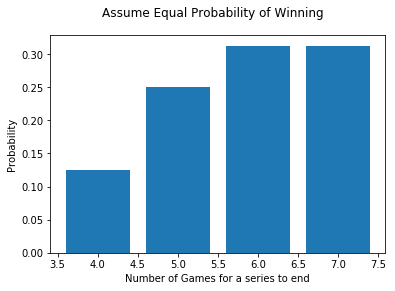
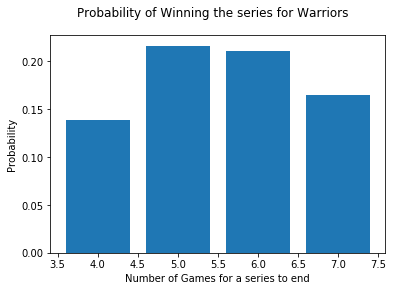

# Executive Summary

The National Basketball Association (NBA) 2018-19 season is just around the corner. Not too long ago the NBA 2017-18 final ended in a dramatic fashion that the Golden State Warriors finished off the Cleveland Cavaliers in a sweep. In this simple data analysis I showed that the outcome was not so common.

# Introdutction

The outcome was a bit of surprise to many people, to the extent that it was touted as a very competitive match and was widely anticipated a longer series (at least five games).  NBA 2017-18 Final is the second time for these two teams.  The Cavaliers won the championship last time in seven games.  The Golden State Warriors featured Steph Curry and Klay Thompson, et al, whereas the Cavaliers featured LeBron James, Kevin Love, but without Kyrie Irving, who played a significant role in Cavaliers' win against the Warriors last year.

While both teams made it to the final, neither team was top seeded. Golden State Warriors was seeded second in the Western Conference and had to beat Houston Rockets in the Conference final. The Cleveland Cavaliers were seeded fourth in the Eastern Conference and had to beat Boston Celtics to get to the final.  As if this is not eough of a drama, in the final seconds of the regulation in Game 1, the scores were tied. J.R. Smith of the Cavaliers grabbed the rebound and passed the ball out without a shot. The Warriors subsequently beat the Cavaliers in the extra time. That crucial action could turn the series around completely. Had he attempted the shot, Cavaliers could clinch Game 1 and avoided a sweep. 

If we assume that the chance of winning a game between Warriors and Cavaliers in the final is 50/50. For the series to end in 4 games by either team, the winning team has to win four games in a row and there is only way this can occur. 


```python
import numpy as np
import matplotlib.pyplot as plt
%matplotlib inline

r'$p(X=4) = \binom{3}{3} (0.5)^3 (0.5)^0 (0.5)^1$'
```


    '$p(X=4) = \\binom{3}{3} (0.5)^3 (0.5)^0 (0.5)^1$'


## If the series ends in 4 games
The probability of winning the series in four games by a team is 

$p(X=4) = \binom{3}{3} (0.5)^3 (0.5)^0 (0.5)^1 = 0.0625$

## If the series ends in 5 games
For the series to end in 5 games the winning team has to win three of the first 4 games and win the fifth game.  There are $\binom{4}{3}=4$ ways that it can happen. And the probability of winning the series in five games is:  

$p(X=5) = \binom{4}{3} (0.5)^3 (0.5)^1 (0.5)^1 = 0.1250$

## If the series ends in 6 games
For the series to end in 6 games the winning team has to win three of the first 5 games and win the sixth game. There are $\binom{5}{3} = 10$ ways that this can happen. The probability of winning the series is:

$p(X=6) = \binom{5}{3} (0.5)^3 (0.5)^2 (0.5)^1 = 0.15625$

## If the series ends in 7 games
For the series to end in 7 games the winning team has to win three of the first 6 games and win the seventh game.  There are $\binom{6}{3} = 20$ ways that this can happen. The probability of winning the series is:

$p(X=7) = \binom{6}{3} (0.5)^3 (0.5)^3 (0.5)^1 = 0.15625$

Since either Warriors or Cavaliers can win the series, the probability distribution of the number of games to determine a champion in a 7-game series is as follows:

$p(X=4) = 2\binom{3}{3} (0.5)^3 (0.5)^0 (0.5)^1 = 0.1250$

$p(X=5) = 2\binom{4}{3} (0.5)^3 (0.5)^1 (0.5)^1 = 0.250$

$p(X=6) = 2\binom{5}{3} (0.5)^3 (0.5)^2 (0.5)^1 = 0.3125$

$p(X=7) = 2\binom{6}{3} (0.5)^3 (0.5)^3 (0.5)^1 = 0.3125$


```python
X = np.arange(4,8)

plt.bar(X, height = [0.125,0.250,0.3125,0.3125])
plt.xlabel('Number of Games for a series to end')
plt.ylabel('Probability')
plt.suptitle('Assume Equal Probability of Winning')
```


    Text(0.5,0.98,'Assume Equal Probability of Winning')





The chance that a series ends in four games is only $0.125$ or 1 in 8, which is half the probability that the series ends in five games.  And the expected number of games to determine a champion is $E(X) = 4*0.1250 + 5*0.250 + 6*0.3125 + 7*0.3125 = 5.182$ games.  The chance that the series ends in four games is the least likely outcome of the four.

# Discussion

The Golden State Warriors' winning record in the regular season was 54-28 or 0.707 before heading into playoff, whereas the Cleveland Cavaliers was 50-32 or 0.610 for the season. These two teams met twice in the regular season with Warriors winning both games.  On December 25, 2017 Cavaliers lost to Warriors with 92-99 and on January 15, 2018 Cavaliers lost to Warriors 108-118 again.

While the season records heading into playoff are different (0.707 vs 0.610; but not significantly different).  Both teams fought through respective conferences and earned their places in the final.  It is quite reasonable to assume that the chance of winning a single game in the final is 50-50 between them.

Based on this assumption, as the calculation above indicated, the chance of deciding a champion in 4 game sereis  is 0.125 or one in eight, which is half of that of finishing in a 5 games series (0.250).  And the expected number of games to determine a champion in a 7-game series is 5.812 games.  Indeed, the outcome is not as common. And throughout the history of NBA finals there were only 8 other sweeps in previous fifty-nine seasons. 

However, one may argue that, based on the season record and the fact that Warriors won both games in their meetings Warriors would have a higher percentage of winning a game between them. We can estimate the chance of winning between them. I used (54-28) vs. (50-32) or (52-28) vs. (50-30) to estimate the chance of Warriors winning percentage against Cavaliers in the final. Warriors has about 55% percent higher (1.55 to 1, odds ratio) to win a game or 61% vs 39%.

We re-calculate the respective probabilities that each team can win the series as follows.  

## For Warriors to win the series

Here are the probabilities that the Warriors can win the series in 4, 5, 6 or 7 games, respectively,

$p(X=4) = \binom{3}{3} (0.61)^3 (0.39)^0 (0.61)^1 = 0.1385$

$p(X=5) = \binom{4}{3} (0.61)^3 (0.39)^1 (0.61)^1 = 0.2160$

$p(X=6) = \binom{5}{3} (0.61)^3 (0.39)^2 (0.61)^1 = 0.2106$

$p(X=7) = \binom{6}{3} (0.61)^3 (0.39)^3 (0.61)^1 = 0.1643$


```python
plt.bar(X, height=[0.1385, 0.2160, 0.2106, 0.1643])
plt.xlabel('Number of Games for a series to end')
plt.ylabel('Probability')
plt.suptitle('Probability of Winning the series for Warriors')
```


    Text(0.5,0.98,'Probability of Winning the series for Warriors')





## For Cavaliers to win the series

Here are the probabilities that the Cavaliers can win the series in 4, 5, 6 or 7 games, respectively,

$p(X=4) = \binom{3}{3} (0.39)^3 (0.61)^0 (0.39)^1 = 0.023$

$p(X=5) = \binom{4}{3} (0.39)^3 (0.61)^1 (0.39)^1 = 0.056$

$p(X=6) = \binom{5}{3} (0.39)^3 (0.61)^2 (0.39)^1 = 0.086$

$p(X=7) = \binom{6}{3} (0.39)^3 (0.61)^3 (0.39)^1 = 0.105$


```python
plt.bar(X, height=[0.023, 0.056, 0.086, 0.105])
plt.xlabel('Number of Games for a series to end')
plt.ylabel('Probability')
plt.suptitle('Probability of Winning the series for Cavaliers')
```


    Text(0.5,0.98,'Probability of Winning the series for Cavaliers')


Overall the Warriors has a 72.94% chance to win the series, compared to only 27.06% for the Cavaliers. And for the Warriors to win the series in four games the chance is $0.1385$ or about 1 in 8.  This is higher, as expected, compared to that of using 50/50 chance at $0.0625$. Still it is the least likely of the four outcomes.

# Conclusion

Either way, it is not a common outcome for Warriors to win the series in four games. There has been only 8 sweeps in the NBA finals since 1958-59 when Boston Celtics defeated Minneapolis Lakers. Including the 2017-18 sweep of Cavaliers by Warriors, the percentage of sweeps (deciding a champion in 4 games in a 7-game series) stands at 9 out of 60 or only 15%. For Warriors to win the series in 4 games the chance is $0.0625$ under 50-50 assumption; whereas using season recoord estimation the chance for Warriors to win the series in four games is $0.1385$, pretty much in line with the statistics of the history of NBA Finals.   

In retrospect, given that fact that the Warriors had won both games when they met, the outcome of the Warriors sweeping Cavaliers may be expected. But that has not been foreseen by many before the series began.
